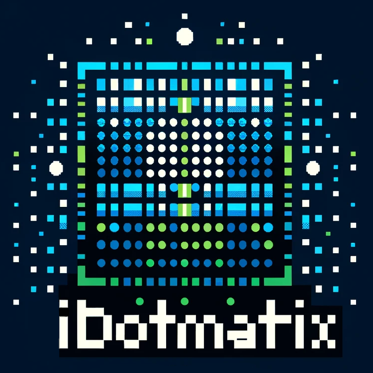

<br/>
<p align="center">
  <a href="https://github.com/derkalle4/python3-idotmatrix-client">
    
  </a>

  <h3 align="center">Pixel Display Client</h3>

  <p align="center">
    control all your 16x16 or 32x32 pixel displays
    <br/>
    <br/>
    <a href="https://github.com/derkalle4/python3-idotmatrix-client"><strong>Explore the docs »</strong></a>
    <br/>
    <br/>
    <a href="https://github.com/derkalle4/python3-idotmatrix-client/issues">Report Bug</a>
    .
    <a href="https://github.com/derkalle4/python3-idotmatrix-client/issues">Request Feature</a>
  </p>
</p>

      

## Table Of Contents

* [About the Project](#about-the-project)
* [Built With](#built-with)
* [Getting Started](#getting-started)
  * [Prerequisites](#prerequisites)
  * [Installation](#installation)
* [Usage](#usage)
* [GUI](#gui)
* [Roadmap](#roadmap)
* [Contributing](#contributing)
* [License](#license)
* [Authors](#authors)
* [Acknowledgements](#acknowledgements)

## About The Project

This repository aims to reverse engineer the [iDotMatrix](https://play.google.com/store/apps/details?id=com.tech.idotmatrix&pli=1) Android App for pixel screen displays like [this one on Aliexpress](https://de.aliexpress.com/item/1005006105517779.html). The goal is to be able to control multiple pixel screen displays via a GUI, an Rest API and the command line.

The initial reason for this project was to have a foundation to update one or multiple pixel displays during live streams on Twitch or other platforms where one can use this to further automate interactions with the audience. Please let us know if you're using this to do so :)

## Built With

* [Python 3](https://www.python.org/downloads/)
* [iDotMatrix Library](https://github.com/derkalle4/python3-idotmatrix-library)
* [argparse](https://docs.python.org/3/library/argparse.html)
* [asyncio](https://docs.python.org/3/library/asyncio.html)
* [bleak](https://github.com/hbldh/bleak)
* [pillow](https://python-pillow.org)
* [PyQt5](https://pypi.org/project/PyQt5/)
* [pyinstaller](https://pyinstaller.org)

## Getting Started

To get a local copy up and running follow these simple example steps:

### Prerequisites

Please install the following for your OS:

* latest Python3
* Python3 Virtual Env

windows users, to use the `.sh` scripts below you will need to use msys/gitbash, or roll your own

### Installation

1. Clone the repo

```sh
git clone https://github.com/derkalle4/python3-idotmatrix-client.git
```

2. Create virtual environment and install all dependencies

```sh
./create_venv.sh
```

## Usage

If you used the ./create_venv.sh you should use this command to run the app:

```sh
./run_in_venv.sh <YOUR_COMMAND_LINE_ARGUMENTS>
```
If you do not use a virtual environment the command will look like this:

```sh
python3 .\app.py <YOUR_COMMAND_LINE_ARGUMENTS>
```

#### command line arguments

##### --address (required for all commands except "scan")

Specifies the address of the pixel display device. Use "auto" to use the first available device (automatically looking for IDM-* devices in range).

```sh
./run_in_venv.sh --address 00:11:22:33:44:ff
```

##### --scan

Scans all bluetooth devices in range for iDotMatrix devices. Quits afterwards. Cannot be combined with other commands (use --address auto instead).

```sh
./run_in_venv.sh --scan
```

##### --sync-time

Sets the time of the device to the current local time.

```sh
./run_in_venv.sh --address 00:11:22:33:44:ff --sync-time
```

###### --set-time

Sets the time of the device to any time you want.

```sh
./run_in_venv.sh --address 00:11:22:33:44:ff --sync-time --set-time 18-12-2023-19:10:10
```

##### --screen

Turns the screen either on or off.

```sh
./run_in_venv.sh --address 00:11:22:33:44:ff --screen on
./run_in_venv.sh --address 00:11:22:33:44:ff --screen off
```

##### --flip-screen

Rotates the device display by 180 degrees. True to rotate. False to disable rotation.

```sh
./run_in_venv.sh --address 00:11:22:33:44:ff --flip-screen true
```

##### --toggle-screen-freeze

Freezes or unfreezes the screen. Does not seem to work currently.

```sh
./run_in_venv.sh --address 00:11:22:33:44:ff --toggle-screen-freeze
```

##### --chronograph

Sets the mode of the cronograph:

- 0 = reset
- 1 = (re)start
- 2 = pause
- 3 = continue after pause

```sh
./run_in_venv.sh --address 00:11:22:33:44:ff --chronograph 0
```

##### --clock

Sets the mode of the clock:

- 0 = default
- 1 = christmas
- 2 = racing
- 3 = inverted full screen
- 4 = animated hourglass
- 5 = frame 1
- 6 = frame 2
- 7 = frame 3

```sh
./run_in_venv.sh --address 00:11:22:33:44:ff --clock 0
```

###### --clock-with-date

Shows the date in addition to the time.

```sh
./run_in_venv.sh --address 00:11:22:33:44:ff --clock 0 --clock-with-date
```

###### --clock-24h

Shows the time in 24h format.

```sh
./run_in_venv.sh --address 00:11:22:33:44:ff --clock 0 --clock-24h
```

###### --clock-color

Sets the color of the clock in format <R0-255>-<G0-255>-<B0-255>

```sh
./run_in_venv.sh --address 00:11:22:33:44:ff --clock 0 --clock-color 255-0-0
```

##### --countdown

Sets the mode of the countdown:

- 0 = disable
- 1 = start
- 2 = pause
- 3 = restart

```sh
./run_in_venv.sh --address 00:11:22:33:44:ff --countdown 1
```

###### --countdown-time

Sets the time of the countdown in format <MINUTES>-<SECONDS>

```sh
./run_in_venv.sh --address 00:11:22:33:44:ff --countdown 1 --countdown-time 5-0
```

##### --fullscreen-color

Sets all pixels to the given color in format <R0-255>-<G0-255>-<B0-255>

```sh
./run_in_venv.sh --address 00:11:22:33:44:ff --fullscreen-color 255-255-255
```

##### --pixel-color

Sets one or multiple pixels to the given color in format <PIXEL-X>-<PIXEL-Y>-<R0-255>-<G0-255>-<B0-255>

```sh
./run_in_venv.sh --address 00:11:22:33:44:ff --pixel-color 10-10-255-255-255
```

##### --scoreboard

Sets the score of the scoreboard <0-999>-<0-999>

```sh
./run_in_venv.sh --address 00:11:22:33:44:ff --scoreboard 21-12
```

##### --image

Wether to enable the image display mode or not. Set to true show an image or false to hide.

```sh
./run_in_venv.sh --address 00:11:22:33:44:ff --image true
```

###### --set-image

Path to an image to display on the device without further processing. This must match your display pixel size (e.g. demo_16.png for the 16x16 variant). See --process-image for more information on how to process a larger (or smaller) image!

If you do not want to process the image: when using Gimp I had to export the file to a 32x32 pixel PNG (for my 32x32 Pixel Display) and disable all features except the "save resolution" feature to save time when sending the image to the device. Every kind of metadata makes the image bigger and because we only can send around 20bytes at once this can certainly increase the transfer time!

The [Demo PNG](https://opengameart.org/content/pixel-art-practice) was downloaded from OpenGameArt.org.

```sh
./run_in_venv.sh --address 00:11:22:33:44:ff --image true --set-image ./images/demo_16.png
./run_in_venv.sh --address 00:11:22:33:44:ff --image true --set-image ./images/demo_32.png
./run_in_venv.sh --address 00:11:22:33:44:ff --image true --set-image ./images/demo_64.png
```

###### --process-image

If specified it will process the given image. If used, the Python3 library Pillow will be utilized to convert the given image to a PNG with the given amount of pixels (e.g. 32 for 32x32 or 16 for 16x16 pixels). Technically you could use all kind of sizes and variations of images. Keep in mind: processing could take some time depending on your computer. In my tests the given demo.png file takes around 1 second without processing and three seconds with processing.

```sh
./run_in_venv.sh --address 00:11:22:33:44:ff --image true --set-image ./images/demo_512.png --process-image 32
```

##### --set-gif

Path to an GIF to display on the device. See --process-gif for more information! The [Demo GIF](https://opengameart.org/content/animated-pixel-torch) was downloaded from OpenGameArt.org.

```sh
./run_in_venv.sh --address 00:11:22:33:44:ff --set-gif ./images/demo.gif
```

###### --process-gif

If specified it will process the given image. If used, the Python3 library Pillow will be utilized to convert the given image to a GIF with the given amount of pixels (e.g. 32 for 32x32 or 16 for 16x16 pixels). Technically you could use all kind of sizes for the GIF. Keep in mind: processing could take some time depending on your computer and using larger GIFs may result in a bad image quality. You should hand-craft your GIFs in the correct format for best results!

```sh
./run_in_venv.sh --address 00:11:22:33:44:ff --set-gif ./images/demo.gif --process-gif 32
```

##### --set-text

Sets a given text to the display. The [Demo Font](https://www.fontspace.com/rain-font-f22577) was downloaded from fontspace.com and is licensed open source (see font folder or link for details).

```sh
./run_in_venv.sh --address 00:11:22:33:44:ff --set-text "Hello World"
```

###### --text-size

Sets the size of the text.

```sh
./run_in_venv.sh --address 00:11:22:33:44:ff --set-text "Hello World" --text-size 10
```

###### --text-mode

Sets the mode of the text.

```sh
./run_in_venv.sh --address 00:11:22:33:44:ff --set-text "Hello World" --text-mode 1
```

###### --text-speed

Sets the speed of the text.

```sh
./run_in_venv.sh --address 00:11:22:33:44:ff --set-text "Hello World" --text-speed 50
```

###### --text-color-mode

Sets the color mode of the text.

```sh
./run_in_venv.sh --address 00:11:22:33:44:ff --set-text "Hello World" --text-color-mode 1
```

###### --text-color

Sets the color of the text.

```sh
./run_in_venv.sh --address 00:11:22:33:44:ff --set-text "Hello World" --text-color 255-255-255
```

###### --text-bg-mode

Sets the background mode of the text.

```sh
./run_in_venv.sh --address 00:11:22:33:44:ff --set-text "Hello World" --text-bg-mode 1
```

###### --text-bg-color

Sets the background color of the text.

```sh
./run_in_venv.sh --address 00:11:22:33:44:ff --set-text "Hello World" --text-bg-color 0-0-255
```

## GUI
### Run Methods
You can run the GUI uncompiled with python, or you can build an executible with Pyinstaller.

#### Method 1) Run via Python
* Open terminal at ```/python3-idotmatrix-client```
* Run ```pip install pyqt5```
* Run ```py gui.py```

#### Method 2) Build and Run
* Run ```build.bat``` for **Windows** or ```build.sh``` for **Linux**
* Click the new ```iDotMatrix Controller``` program in ```/python3-idotmatrix-client```

### Features
* **Device Search**: *Scans for nearby devices, asks for name, adds to home screen.*
* **Clock Style**: *Set the Clock Style and Color. Auto sync time.*
* **Sync Time**: *Sync time to machine clock.*
* **Set Time**: *Set time.*
* **Screen On/Off**: *Turn the screen On or Off.*
* **Stop Watch**: *Use a stop watch.*
* **Countdown Timer**: *Use a Countdown Timer.*
* **Set Text**: *Set the text value and effects.*
* **Color Studio**: *Set background color, or paint your own designs and save them for later use.*
* **Scoreboard**: *Show a three-digit, two player scoreboard.*
* **Set Image**: *Pick an image from the file browser to set. Auto Image Processing.*
* **Set GIF**: *Pick a GIF from the file browser to set. Auto GIF Processing is attempted but does not always work. Source material closer to 16x16 or 32x32 works best.*

### Known Issues
* [ ] Commands somtimes fail to connect to the device. Usually rerunning the last command will work.
* [ ] Screen Flip & Screen Freeze work inconsistantly and are not included with the GUI.

*Found a GUI bug? Submitting a new GUI request? Tag [@TheBigWazz](https://github.com/thebigwazz)*

</br>

## Roadmap

If you want to contribute please focus on the reverse-engineering part (find more information in the [iDotMatrix Library](https://github.com/derkalle4/python3-idotmatrix-library)). Many thanks for all contributions! If you want to dive deep into other issues please check for "#TODO" comments in the source code as well.

* [X] outsource the reverse-engineered part to a library (suggestion from issue #17)
* [ ] build configuration file to manage (multiple) devices
* [ ] Build command line interface with all features to interact with the device
* [ ] Build RestAPI to interact with the device remotely
    * [ ] Homeassistant Integration
* [X] Build GUI to allow non-technical people to use this software
* [X] build search tool to find displays nearby
* [ ] make this software compatible with Windows and Linux
* [ ] provide executables for Windows

## Contributing

Contributions are what make the open source community such an amazing place to be learn, inspire, and create. Any contributions you make are **greatly appreciated**.
* If you have suggestions for adding or removing projects, feel free to [open an issue](https://github.com/derkalle4/python3-idotmatrix-client/issues/new) to discuss it, or directly create a pull request after you edit the *README.md* file with necessary changes.
* Please make sure you check your spelling and grammar.
* Create individual PR for each suggestion.
* Please also read through the [Code Of Conduct](https://github.com/derkalle4/python3-idotmatrix-client/blob/main/CODE_OF_CONDUCT.md) before posting your first idea as well.

### Creating A Pull Request

1. Fork the Project
2. Create your Feature Branch (`git checkout -b feature/AmazingFeature`)
3. Commit your Changes (`git commit -m 'Add some AmazingFeature'`)
4. Push to the Branch (`git push origin feature/AmazingFeature`)
5. Open a Pull Request

## License

Distributed under the GNU GENERAL PUBLIC License. See [LICENSE](https://github.com/derkalle4/python3-idotmatrix-client/blob/main/LICENSE) for more information.

## Authors

* [Kalle Minkner](https://github.com/derkalle4) - *Project Founder*
* [Jon-Mailes Graeffe](https://github.com/jmgraeffe) - *Co-Founder*

## Acknowledgements

* [Othneil Drew](https://github.com/othneildrew/Best-README-Template) - *README Template*
* [LordRippon](https://github.com/LordRippon) - *Reverse Engineering for the Displays*
* [8none1](https://github.com/8none1) - *Reverse Engineering for the Displays*
* [schorsch3000](https://github.com/schorsch3000) - *smaller fixes*
* [tekka007](https://github.com/tekka007) - *code refactoring and reverse engineering*
* [inselberg](https://github.com/inselberg) - *Reverse Engineering for the Displays*
* [TheBigWazz](https://github.com/thebigwazz) - *GUI and Device Search*
